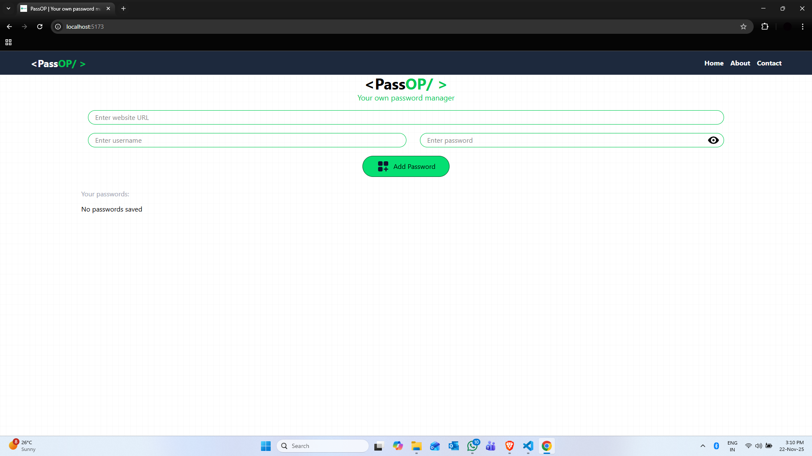

# PassOP - Password Manager

A lightweight, browser-based password manager built with React and Vite. Store and manage your passwords securely in your browser's local storage.

<p align='center'>

</p>

##  Overview

PassOP is a simple yet functional password management application that allows users to:
- Store website credentials (URL, username, password)
- View all saved passwords in a clean table format
- Toggle password visibility for security
- Persist data locally in the browser

The app provides a user-friendly interface with a modern design, making password management accessible and straightforward.

##  Features

- **Add Passwords**: Save website URLs with corresponding usernames and passwords
- **View Passwords**: Display all stored credentials in an organized table
- **Toggle Visibility**: Show/hide password fields with an icon toggle
- **Local Storage**: Passwords are automatically saved to browser's localStorage
- **Responsive UI**: Clean, modern interface built with Tailwind CSS
- **Data Persistence**: Passwords persist across browser sessions

##  Tech Stack

### Frontend Framework
- **React** (v19.1.1) - UI library for building interactive components
- **Vite** (v7.1.2) - Fast build tool and development server

### Styling
- **Tailwind CSS** (v4.1.13) - Utility-first CSS framework
- **Tailwind CSS Vite Plugin** (v4.1.13) - Integration for Vite

### Development Tools
- **Node.js** - JavaScript runtime
- **ESLint** (v9.33.0) - Code linting
- **React ESLint Plugins** - React-specific linting rules

### Storage
- **Browser LocalStorage** - Client-side data persistence

##  Architecture & Data Flow

### Component Structure

```
App
├── Navbar
│   └── Navigation menu with site branding
└── Manager
    ├── Password input form
    ├── Show/hide password toggle
    ├── Add password button
    └── Passwords display table
```

### Data Flow

```
1. User Input
   ↓
2. handleChange() updates form state
   ↓
3. User clicks "Add Password"
   ↓
4. savePassword() triggered
   ├── Creates new array with existing passwords + new entry
   ├── Updates passwordArray state
   └── Saves to localStorage as JSON
   ↓
5. Component re-renders with updated passwordArray
   ↓
6. Map over passwordArray to display in table
```

### State Management

#### Form State
```javascript
form = {
  site: "",        // Website URL
  username: "",    // Username or email
  password: ""     // Password
}
```

#### Passwords Array State
```javascript
passwordArray = [
  { site: "example.com", username: "user@email.com", password: "pass123" },
  { site: "github.com", username: "myusername", password: "token123" },
  // ...more entries
]
```

##  File Structure

```
passop/
├── src/
│   ├── components/
│   │   ├── Manager.jsx      # Main password management component
│   │   └── Navbar.jsx       # Navigation bar component
│   ├── App.jsx              # Root application component
│   ├── App.css              # App-level styles
│   ├── main.jsx             # React entry point
│   └── index.css            # Global styles
├── public/                  # Static assets
├── index.html               # HTML template
├── vite.config.js           # Vite configuration
├── eslint.config.js         # ESLint rules
├── package.json             # Project dependencies
└── README.md                # This file
```

##  Getting Started

### Prerequisites
- Node.js (v14 or higher recommended)
- npm or yarn package manager

### Installation

1. Clone the repository or navigate to the project directory:
```bash
cd passop
```

2. Install dependencies:
```bash
npm install
```

### Development

Start the development server:
```bash
npm run dev
```

The application will be available at `http://localhost:5173` (or another port if 5173 is in use).

### Build

Create a production build:
```bash
npm run build
```

The optimized build will be in the `dist/` directory.

### Preview Production Build

Preview the production build locally:
```bash
npm run preview
```

### Linting

Check code quality:
```bash
npm run lint
```

##  Data Storage

### LocalStorage Implementation

Passwords are stored in the browser's localStorage with the key `"passwords"`:

- **Storage Location**: Browser's local storage (domain-specific)
- **Data Format**: JSON array of password objects
- **Persistence**: Data persists until manually cleared or browser cache is cleared
- **Limitations**: 
  - Typically 5-10MB limit per domain
  - Not encrypted (stored as plain text)
  - Only accessible from the same domain

### Data Initialization

On component mount, the `useEffect` hook:
1. Retrieves `"passwords"` from localStorage
2. Parses the JSON string
3. Populates the `passwordArray` state

##  UI Components

### Manager Component Features

- **Input Form**: Three input fields for site URL, username, and password
- **Toggle Button**: Eye icon to show/hide password input
- **Add Button**: Styled button with lord-icon animation
- **Password Table**: Displays stored credentials in a responsive table

### Styling

- **Theme**: Green accent color (#10b981 for Tailwind green-500)
- **Layout**: Centered container with responsive design
- **Icons**: External icons from icons8.com and lordicon

##  Key Functions

### `Manager.jsx` Functions

- **`showPassword()`** - Toggles password visibility by switching icon
- **`savePassword()`** - Adds new password to array and updates localStorage
- **`handleChange(e)`** - Updates form state as user types

##  Future Enhancements

- Search/filter functionality for saved passwords
- Edit existing passwords
- Delete passwords
- Password strength indicator
- Master password protection
- Export/import functionality
- Encryption support
- Dark mode theme
- Password generation utility

## Connect With Me
- **LinkedIn:** https://www.linkedin.com/in/devadi 
- **GitHub:** https://github.com/ADI-2707